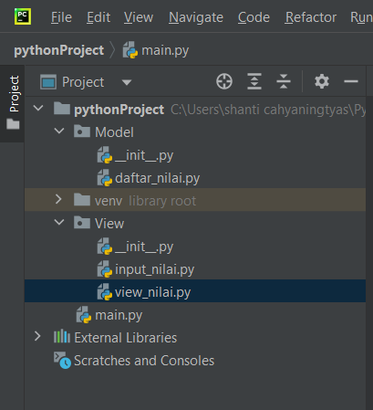
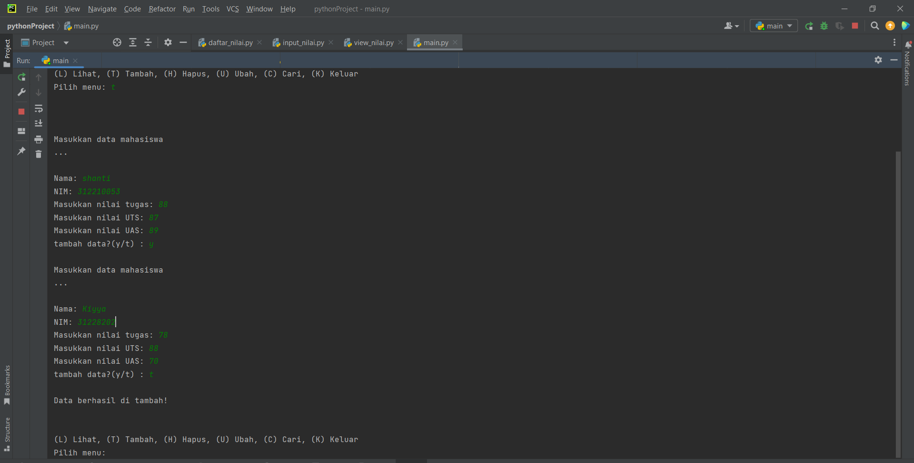
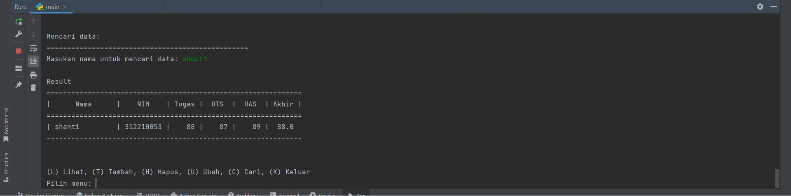

# UAS


NAMA  : SHANTI CAHYANINGTYAS
KELAS : TI.22.C.1


# Struktur Package dan Modul



# Penjelasan 

## Model 

daftar_nilai

- Tambah data

1. data = {} untuk menampung list data yang nanti akan terinput
2. deklarasikan fungsi def tambah_data():
3. nama = input("Masukan nama: ") lalu tambahkan input nama, nim, nilai tugas, uts, uas
4. nilai_akhir = (nilai_tugas)*30/100 + (nilai_uts)*35/100 + (nilai_uas)*35/100 untuk nilai akhir yang diambil dari perhitungan 3 komponen nilai (nilai_tugas: 30%,    nilai_uts: 35%, nilai_uas: 35%)
5. data[nama] = [nama, nim, nilai_tugas, nilai_uts, nilai_uas, nilai_akhir] kita akan masukkan data yang tadi kita input ke dalam `data[nama]'
6. lalu cetak print()

- Ubah data

1. deklarasikan fungsi def ubah_data(): nama = input("Masukan nama untuk mengubah data: ") kita akan menginput data yang nanti akan di ubah
2. if nama in data.keys(): print("Apa yang akan di ubah?") jika 'nama' dari di dalam 'data' maka akan mengembalikan daftar menggunakan fungsi 'keys()' lalu akan di cetak 'print()'
3. sub_data = input("(Semua), (Nama), (NIM), (Tugas), (UTS), (UAS) : ") membuat menu ubah di dalam sub_data
4. if sub_data.lower() == "semua": ambil kata kunci 'semua' di dalam sub_data jika 'semua' maka input data[nama][1] = input("Ubah NIM:") data[nama][2] = int(input("Ubah Nilai Tugas: ")) data[nama][3] = int(input("Ubah Nilai UTS: ")) data[nama][4] = int(input("Ubah Nilai UAS: "))
5. data[nama][5] = data[nama][2] *30/100 + data[nama][3]*35/100 + data[nama][4] *35/100 kita dapatkan nilai akhir dengan diambil dari perhitungan 3 komponen nilai (tugas: 30%, uts: 35%, uas: 35%), ket: [5] = nilai_akhir, dimana [0] = nama
lalu cetak print("\n Berhasil Mengubah data")
6. Jika kita ingin mengubah data tertentu maka elif sub_data.lower() == "nim": data[nama][1] = input("NIM:") dan berlaku juga untuk nilai tugas, UTS dan UAS
lalu cetak print("\nBerhasil ubah data!")
7. else: print("'{}' tidak ditemukan.".format(nama)) jika kita salah dalam memasukkan nama untuk mengubah data maka akan muncul 'nama tidak di temukan'


- Cari data

1. deklarasikan fungsi def cari_data():
nama = input("Masukan nama yang akan di cari datanya : ") kita akan menginput data yang akan dicari
2. if nama in data.keys(): kita akan mengambil list 'nama' di dalam 'data' menggunakan pengkondisian
3. maka cetak print("| {0:14} | {1:9} | {2:5} | {3:5} | {4:5} | {5:5}" .format(nama, data[nama][1], data[nama][2], data[nama][3], data[nama][4], data[nama][5])) untuk menampilkan data yang tersedia
4. else: print("'{}' tidak ditemukan.".format(nama)) jika data yang kita input salah/tidak ditemukan maka akan tercetak 'nama tidak di temukan' 

- Hapus data

1. deklarasikan fungsi def hapus_data():
2. nama = input("Masukan nama yang akan anda hapus datanya : ") kita akan menginput data yang nanti akan dihapus
3. if nama in data.keys(): kita mengambil list 'nama' di dalam 'data' menggunakan pengkondisian
4. del data[nama] hapus semua 'nama' yang ada di dalam 'data'
5. jika sudah maka cetak print("sub_data '{}' berhasil dihapus.".format(nama))
6. else: print("'{}' tidak ditemukan.".format(nama)) jika ada data yang kita input salah/tidak ditemukan maka akan di tercetak 'nama tidak ditemukan'

## View

- input_nilai = menambahkan fungsi input yang nantinya akan di deklarasikan di setiap modulenya , def input_nama(): def input_nim(): dan yang lainnya yang akan di masukkan ke dalam data ={}

- view_nilai = deklarasikamnfungsi def lihat_data(): kita menggunakan  kondisi percabangan if, ambil data yang tertera pada data lalu cetak print()

 
## file main.py 

```bash

from Model.daftar_nilai import *
from View.view_nilai import *

#Mulai
print("===============================================================")
print("|                           Program 1                         |")
print("|    312210053                                     TI.22.C1   |")
print("|                       Shanti Cahayningtyas                  |")
print("===============================================================")

while True:
    print("\n")
    menu = input("(L) Lihat, (T) Tambah, (H) Hapus, (U) Ubah, (C) Cari, (K) Keluar\nPilih menu: ")
    print("\n")

    # menu
    if menu.lower() == 't':
        tambah_data()

    elif menu.lower() == 'c':
        cari_data()

    elif menu.lower() == 'l':
        lihat_data()

    elif menu.lower() == 'u':
        ubah_data()

    elif menu.lower() == 'h':
        hapus_data()

    # Keluar
    elif menu.lower() == 'k':
        break

    else:
        print("Program belum selesai !")


 ```

## Output 

# Tampilan Awal
 

 # Tambah Data 
 

 # Lihat Data Setelah Di Ubah
 

 # Ubah Data
 

 # Lihat Data Setelah Di Ubah
 .png)

 # Cari Data
 

 # Hapus Data 
 


 ## TUTORIAL PDF

[TUTORPDF](assets/PROJECT UJIAN AKHIR Shanti)
